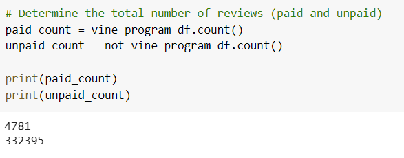
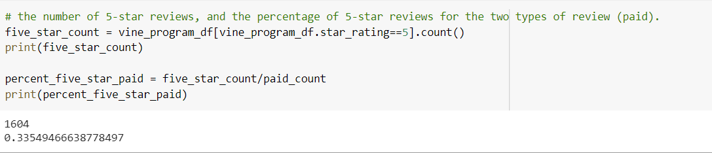
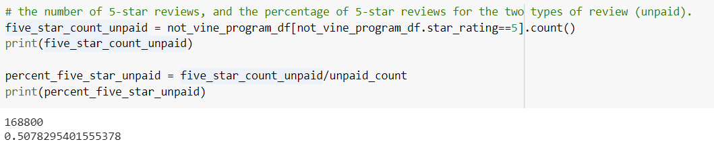

# Amazon_Vine_Analysis

## Project Overview

This project involves analyzing Amazon reviews written by members of the paid Amazon Vine program, which is a service that allows manufacturers and publishers to receive reviews for their products.

### Purpose

Analyze Amazon reviews written by members of the paid Amazon Vine program and unpaid reviewers and determine if there is any bias toward favorable reviews from Vine members in the dataset.

## Resources

- Data Source: https://s3.amazonaws.com/amazon-reviews-pds/tsv/amazon_reviews_us_Books_v1_01.tsv.gz
- Software: PySpark to perform ETL process, AWS RDS, pgAdmin
  
## Results

In the dataset I used, there were 4,781 Vine reviews and 332,395 non-Vine reviews.

Out of the 4,781 Vine reviews, 1,604 were 5 stars and roughly 34 percent of Vine reviews were five stars.

Out of the 332,395 non-Vine reviews, 168,800 were 5 stars and about 51% of the reviews were five stars.

## Summary

 Results show that reviewers who were part of the Vine program generally gave lower reviews (roughly 34 percent of all Vine program members gave 5 stars whereas that number was around 51 percent for non-Vine reviewers). 
 
 This might suggest that non-Vine reviewers were so passionate about a product that they took the time to write a review and Vine reviewers were just reviewing a product for the payment. 
 
 To determine whether this is true, more analysis is needed.
  One way to gain more insight would be to analyze the words reviewers used (i.e. is a word more positive, negative, larger, smaller etc) and the amount reviewers write.

We also have to keep in mind that there were 327,614 more reviews from non-Vine members than Vine members, which could mean that our data is skewed. 
I would suggest running a statistical significance test on this data as well as analyses to see if there's any statistically significant skew.